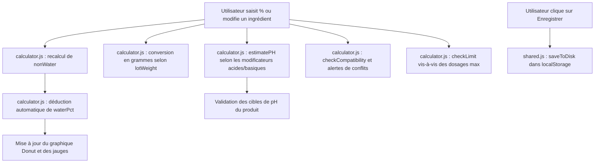

# Documentation Fonctionnelle et Logique de l'Application · Miss Miracle Cosmetics

Ce document décrit en détail le cahier des charges, la structure technique, les flux de données et toutes les logiques de calcul implémentées dans l'application **The Miracle Lab** de **Miss Miracle Cosmetics**.

---

## 1. Vue d'Ensemble & Objectifs du Projet

L'application **The Miracle Lab** est un outil d'aide à la formulation cosmétique autonome (exécutable en local dans le navigateur). Elle s'adresse à deux types d'utilisateurs :
1. **Les Clients (Formulateurs)** : Ils créent, testent et sauvegardent des formules cosmétiques (soins capillaires ou de la peau). Ils peuvent consulter une bibliothèque d'ingrédients, vérifier la viabilité de leurs formules (pH, compatibilité chimique, limites de dosage) et calculer le coût de revient de leurs préparations.
2. **L'Administrateur (Console Admin)** : Il supervise les clients (statut d'abonnement, nombre de formules créées), peut usurper temporairement l'identité d'un client pour l'assister, et gère les conversations de support en direct.

---

## 2. Architecture Modulaire du Projet

À l'origine, le projet était constitué d'un seul fichier monolithique de plus de 5 000 lignes (`index.html.bak`). Il a été découpé dans le dossier `frontend/` pour séparer proprement le code HTML, CSS et JavaScript :

* **Fichier Racine** : `index.html` (qui redirige directement vers `frontend/index.html`).
* **Pages HTML** :
  * `frontend/index.html` : La page d'accueil de la marque et vitrine de présentation.
  * `frontend/login.html` : La page de connexion avec la gestion des sessions fictives.
  * `frontend/register.html` : Formulaire d'inscription.
  * `frontend/dashboard-client.html` : L'espace de travail du formulateur (Calculette, Bibliothèque, Mes Formules).
  * `frontend/dashboard-admin.html` : Le panneau d'administration pour la gestion des clients et le support chat.
  * `frontend/payment.html` : Page de démonstration de paiement pour l'activation des abonnements.
* **Feuille de Style** : `frontend/css/style.css`.
* **Scripts JavaScript** :
  * `frontend/js/shared.js` : Gère la base de données fictive (utilisateurs, sessions, historiques de chat) persistée dans le `localStorage`.
  * `frontend/js/calculator.js` : Contient l'intelligence métier de la calculette cosmétique (base de données d'ingrédients, logique des phases, calculs de pH, coûts et règles de compatibilité).

---

## 3. Logique Fonctionnelle et Moteurs de Calcul

L'intégralité des calculs est centralisée dans le fichier `calculator.js`.

### 3.1. Le Moteur de Formulation (Calculette)

La formulation cosmétique repose sur une répartition stricte des ingrédients en **phases** (Phase Aqueuse, Phase Huileuse, Refroidissement).

#### A. Règle des 100 % et Calcul de l'Eau
Dans une formulation contenant de l'eau, le formulateur ajoute divers actifs, émulsifiants et huiles, puis "complète à 100%" avec de l'eau.
* La fonction `nonWater(phases)` additionne tous les pourcentages saisis par l'utilisateur 
* La fonction `waterPct(phases, formulaType)` calcule le pourcentage d'eau restant :
  $$\% \text{ Eau} = \text{Max}(0, 100 - \sum \% \text{ des autres ingrédients})$$
* Si le total des ingrédients (hors eau) dépasse $100.001\%$, l'application passe en état d'erreur (`isOver() = true`), affiche une alerte rouge et indique de combien de pourcentages la formule doit être réduite.

#### B. Conversion des Pourcentages en Grammes
L'utilisateur définit un **poids de lot** (taille de la préparation finale, par défaut 1000g). L'application calcule instantanément le poids en grammes de chaque ligne de la formule :
$$\text{Poids (g)} = \frac{\text{Poids total du lot (g)} \times \% \text{ de l'ingrédient}}{100}$$

---

### 3.2. Le Moteur d'Estimation du pH

Pour éviter des formulations dangereuses pour la peau ou les cheveux, l'application estime dynamiquement le pH à l'aide de coefficients de pondération empiriques (fonction `estimatePH()`).

* **Base de départ** : Le pH de l'eau distillée est posé par défaut à **6.5**.
* **Impact des acidifiants** (baissent le pH) :
  * **Acide Citrique** : $-7.0$ par $\%$ d'ingrédient.
  * **Acide Lactique** : $-4.0$ par $\%$ d'ingrédient.
  * **Acide Salicylique** : $-3.0$ par $\%$ d'ingrédient.
  * **Acide Benzoïque / Acide Sorbique** : $-2.0$ par $\%$ d'ingrédient.
  * Ingrédients avec la mention "Baisse le pH" : $-1.5$ par $\%$ d'ingrédient.
* **Impact des alcalinisants** (montent le pH) :
  * **Hydroxyde de Sodium (NaOH)** : $+10.0$ par $\%$ d'ingrédient.
  * **Triéthanolamine (TEA)** : $+3.0$ par $\%$ d'ingrédient.
  * Ingrédients avec la mention "Monte le pH" : $+1.5$ par $\%$ d'ingrédient.
* **Bornes de sécurité** : Le pH estimé est contraint entre **2.5** (extrêmement acide) et **9.0** (très basique).
* **Validation des cibles** : Chaque type de formule a une plage cible de pH (ex: $4.0 - 5.5$ pour un après-shampoing). Si l'estimation sort de cette plage, l'application suggère l'ajout d'ajusteurs de pH adaptés.

---

### 3.3. Le Moteur de Compatibilité Chimique

L'application vérifie en temps réel les règles de formulation suivantes à l'aide du tableau `COMPAT_RULES` :
1. **Incompatibilité Cationique/Anionique** : Les ingrédients chargés positivement (cationiques, comme le *BTMS-50* ou le *Behentrimonium Chloride*, très utilisés pour démêler les cheveux) réagissent avec les tensioactifs chargés négativement (anioniques, comme le *Texapon N70* dans les shampoings). Leur mélange provoque une floculation (grumeaux) et détruit la formule. L'application lève une erreur visuelle immédiate.
2. **Inactivation des Conservateurs** : Certains conservateurs naturels (Benzoate de Sodium, Sorbate de Potassium) ne sont actifs que sous forme d'acides non dissociés. Ils nécessitent un environnement acide ($pH < 5.5$). Si le pH estimé est trop élevé, l'application conseille d'ajouter un acide.
3. **Dégradation de la Niacinamide** : À un pH trop bas ($pH < 4.0$), la Niacinamide (vitamine B3) s'hydrolyse en acide nicotinique, ce qui provoque des rougeurs cutanées (flush). Une alerte invite à maintenir le pH au-dessus de 4.0.
4. **Efficacité du Phénoxyéthanol** : Ce conservateur perd son action au-dessus de $pH = 7.0$. L'application prévient l'utilisateur s'il formule en milieu trop basique.

---

### 3.4. Contrôle des Limites de Dosage (Max Pct)

Chaque ingrédient de la bibliothèque possède une limite de dosage recommandée (ex: max 1% pour les huiles essentielles, max 5% pour le Panthénol). La fonction `checkLimit()` compare le pourcentage saisi par le formulateur à cette limite maximale :
* Si la dose dépasse le maximum : affiche un badge rouge d'avertissement.
* Si la dose approche du maximum (à plus de 90 % de la limite) : affiche un badge orange de vigilance.

---

### 3.5. Calculateur de Prix de Revient

Lorsque l'utilisateur clique sur le bouton **Coûts**, une colonne "Prix/kg" apparaît pour chaque ingrédient.
* L'utilisateur saisit le prix d'achat au kilo.
* L'application calcule le coût individuel de chaque ingrédient :
  $$\text{Coût de l'ingrédient} = \frac{\text{Prix/kg} \times \text{Poids utilisé (g)}}{1000}$$
* Elle calcule ensuite le coût total du lot en additionnant le coût de toutes les matières premières (l'eau est considérée comme gratuite).

---

## 4. Gestion de la Base de Données Fictive (LocalStorage)

L'application est 100% autonome et n'utilise pas de base de données externe. Elle simule toutes les données dans le stockage local du navigateur (`localStorage`) :

| Clé LocalStorage | Contenu | Rôle |
| :--- | :--- | :--- |
| `miracle_lab_v3` | Tableau d'objets (Formules) | Enregistre les formules des utilisateurs (nom, type, pourcentages, notes, catégorie). |
| `miracle_clients_v3` | Tableau d'objets (Utilisateurs) | Liste des clients, numéros de téléphone, abonnements (Actif, Expiré, Inactif). |
| `miracle_chats_v3` | Dictionnaire `{ email: [messages] }` | Historique des discussions de support simulées pour chaque client. |
| `miracle_currentUser` | Objet utilisateur | Session active (détermine si l'utilisateur est client ou admin). |
| `miracle_simulatedEmail` | String (E-mail) | Utilisé par l'Admin pour basculer sur la session d'un client. |

---

## 5. Fonctionnalités Secondaires et Outils de Confort

* **Historique d'annulation (Undo/Redo)** : Un système d'historique capture l'état des phases à chaque modification. L'utilisateur peut revenir en arrière (raccourci `Ctrl+Z` ou bouton `↩`).
* **Exportation** :
  * **Copier** : Génère un résumé textuel structuré de la formule prêt à être partagé (nom, phases, pourcentages, poids en grammes, pH estimé).
  * **PDF** : Prépare la mise en page de la fiche laboratoire de fabrication.
* **Discussion de Support** : Un widget de discussion instantanée simule un dialogue d'aide. L'administrateur peut visualiser ces messages et y répondre depuis sa console.

---

## 6. Synthèse du Flux des Données

---

*Document de spécification établi pour The Miracle Lab - Miss Miracle Cosmetics.*
