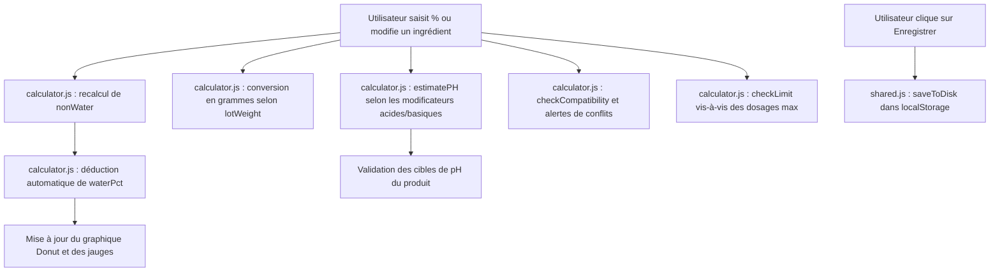

# Documentation Fonctionnelle et Logique de l'Application · Miss Miracle Cosmetics

Ce document décrit en détail le cahier des charges, la structure technique, les flux de données et toutes les logiques de calcul implémentées dans l'application **The Miracle Lab** de **Miss Miracle Cosmetics**.

---

## 1. Vue d'Ensemble & Objectifs du Projet

L'application **The Miracle Lab** est un outil d'aide à la formulation cosmétique autonome (exécutable en local dans le navigateur). Elle s'adresse à deux types d'utilisateurs :
1. **Les Clients (Formulateurs)** : Ils créent, testent et sauvegardent des formules cosmétiques (soins capillaires ou de la peau). Ils peuvent consulter une bibliothèque d'ingrédients, vérifier la viabilité de leurs formules (pH, compatibilité chimique, limites de dosage) et calculer le coût de revient de leurs préparations.
2. **L'Administrateur (Console Admin)** : Il supervise les clients (statut d'abonnement, nombre de formules créées), peut usurper temporairement l'identité d'un client pour l'assister, et gère les conversations de support en direct.

---

## 2. Architecture Modulaire du Projet

À l'origine, le projet était constitué d'un seul fichier monolithique de plus de 5 000 lignes (`index.html.bak`). Il a été découpé dans le dossier `frontend/` pour séparer proprement le code HTML, CSS et JavaScript :

* **Fichier Racine** : `index.html` (qui redirige directement vers `frontend/index.html`).
* **Pages HTML** :
  * `frontend/index.html` : La page d'accueil de la marque et vitrine de présentation.
  * `frontend/login.html` : La page de connexion avec la gestion des sessions fictives.
  * `frontend/register.html` : Formulaire d'inscription.
  * `frontend/dashboard-client.html` : L'espace de travail du formulateur (Calculette, Bibliothèque, Mes Formules).
  * `frontend/dashboard-admin.html` : Le panneau d'administration pour la gestion des clients et le support chat.
  * `frontend/payment.html` : Page de démonstration de paiement pour l'activation des abonnements.
* **Feuille de Style** : `frontend/css/style.css`.
* **Scripts JavaScript** :
  * `frontend/js/shared.js` : Gère la base de données fictive (utilisateurs, sessions, historiques de chat) persistée dans le `localStorage`.
  * `frontend/js/calculator.js` : Contient l'intelligence métier de la calculette cosmétique (base de données d'ingrédients, logique des phases, calculs de---

## 3. Logique Fonctionnelle et Moteurs de Calcul (Code d'Origine de `index.html.bak`)

L'intégralité des calculs est centralisée dans le fichier [calculator.js](file:///c:/missmiracle/frontend/js/calculator.js) (et se trouvait historiquement dans la section script de [index.html.bak](file:///c:/missmiracle/index.html.bak) entre les lignes 3020 et 3296).

### 3.1. Le Moteur de Formulation (Calculette)

La formulation cosmétique repose sur une répartition des ingrédients en **phases** (Phase Aqueuse, Phase Huileuse, Refroidissement).

#### A. Règle des 100 % et Calcul de l'Eau
Dans une formulation contenant de l'eau, le système calcule automatiquement le pourcentage d'eau nécessaire pour compléter la formule à 100 % à l'aide des fonctions suivantes :

```javascript
// Calcule la somme des pourcentages d'une phase donnée
function sumPhase(rows) { 
  return rows.reduce((a, r) => a + (parseFloat(r.pct) || 0), 0); 
}

// Calcule la somme de tous les ingrédients saisis par l'utilisateur (hors eau automatique)
function nonWater() { 
  return Object.values(state.phases).reduce((a, rows) => a + sumPhase(rows), 0); 
}

// Calcule automatiquement la part d'eau restante pour atteindre 100%
function waterPct() {
  const type = FORMULA_TYPES[state.formulaType];
  if (!type.hasWater) return 0;
  return Math.max(0, parseFloat((100 - nonWater()).toFixed(4)));
}

// Calcule le total général (Ingrédients + Eau)
function totalPct() { 
  return nonWater() + waterPct(); 
}

// Vérifie si la formule est en surdosage (> 100%)
function isOver() { 
  return nonWater() > 100.001; 
}

// Confirme si la formule fait exactement 100%
function isOk() { 
  return !isOver() && Math.abs(totalPct() - 100) < 0.01; 
}
```

* Si le total des ingrédients saisis par le formulateur dépasse $100\%$, la fonction `isOver()` passe à `true`, affichant une alerte rouge et calculant l'excès à réduire : `(nonWater() - 100)%`.

#### B. Conversion des Pourcentages en Grammes
Le formulateur définit un **poids de lot** (taille de la préparation finale en grammes, par défaut 1000g). La calculette applique instantanément la conversion pour chaque ingrédient ainsi que pour l'eau :

```javascript
function effectiveWeight() { 
  return state.totalWeight || 1000; 
}
```
$$\text{Poids de l'ingrédient (g)} = \frac{\text{Poids du lot (g)} \times \% \text{ de l'ingrédient}}{100}$$

---

### 3.2. Le Moteur d'Estimation du pH

Pour anticiper les ajustements de laboratoire, l'application estime en temps réel le pH des formules aqueuses en appliquant des coefficients pondérés selon les pourcentages des ingrédients :

```javascript
function estimatePH() {
  const type = FORMULA_TYPES[state.formulaType];
  if (!type.hasWater) return null;
  let ph = 6.5; // baseline neutre pour l'eau distillée
  for (const rows of Object.values(state.phases)) {
    for (const row of rows) {
      if (!row.name) continue;
      const pct = parseFloat(row.pct) || 0;
      if (!pct) continue;
      
      // Impact des régulateurs et acides connus
      if (row.name.includes("Acide Citrique")) ph -= pct * 7;
      else if (row.name.includes("Acide Lactique")) ph -= pct * 4;
      else if (row.name.includes("Acide Benzoïque") || row.name.includes("Acide Sorbique")) ph -= pct * 2;
      else if (row.name.includes("Hydroxyde de Sodium") || row.name.includes("NaOH")) ph += pct * 10;
      else if (row.name.includes("Triéthanolamine")) ph += pct * 3;
      else if (row.name.includes("Acide Salicylique")) ph -= pct * 3;
      else {
        // Impact des notes d'ingrédients de la bibliothèque
        const data = getIngredientData(row.name);
        if (data && data.phNote) {
          if (data.phNote.includes("Baisse")) ph -= pct * 1.5;
          else if (data.phNote.includes("Monte")) ph += pct * 1.5;
          else if (data.group === "Conservateurs") ph -= pct * 0.15;
        }
      }
    }
  }
  // Borne le pH final simulé entre 2.5 et 9.0 pour éviter des résultats aberrants
  return Math.max(2.5, Math.min(9.0, parseFloat(ph.toFixed(1))));
}
```

L'application compare le résultat obtenu à la cible de pH (`phTarget`) du produit fini (ex: $4.5 - 6.0$ pour un spray sans rinçage) via la fonction `getPhStatus()` et génère des conseils d'ajustement.

---

### 3.3. Le Moteur de Compatibilité Chimique

L'application intègre un moteur de compatibilité basé sur des règles définies dans le tableau `COMPAT_RULES`. Il valide en temps réel si les ingrédients peuvent coexister :

```javascript
const COMPAT_RULES = [
  {
    groupA: ["BTMS-50", "BTMS-25", "Behentrimonium Chloride", "Honeyquat", "Polyquaternium-7", "Polyquaternium-10", "Guar Cationique", "Protéines Cationiques de Soja"],
    groupB: ["Texapon N70", "Texapon NSO", "Texapon ASV", "Coco Glucoside", "Decyl Glucoside", "Lauryl Glucoside", "Sodium Cocoyl Isethionate (SCI)", "Sodium Lauryl Sulfoacetate (SLSA)", "Sodium Cocoyl Glutamate", "Sodium Lauroyl Sarcosinate", "Cocamidopropyl Bétaïne (CAPB)"],
    type: "error", msg: "Ingrédient cationique (+) et anionique (-) ensemble → risque de floculation et déstabilisation de l'émulsion"
  },
  {
    groupA: ["Benzoate de Sodium", "Sorbate de Potassium", "Benzoate + Sorbate (combo)", "Acide Benzoïque", "Acide Sorbique"],
    groupB: ["__NO_ACID__"],
    type: "warn", msg: "Benzoate/Sorbate inactifs sans acidifiant — Ajouter Acide Citrique ou Lactique pour descendre le pH sous 5.5"
  },
  {
    groupA: ["Niacinamide"],
    groupB: ["Acide Citrique", "Acide Lactique"],
    type: "warn", msg: "Niacinamide + Acide fort → à pH < 4, conversion en niacine irritante. Maintenir pH > 4"
  },
  {
    groupA: ["Phénoxyéthanol"],
    groupB: ["__HIGH_PH__"],
    type: "warn", msg: "Phénoxyéthanol perd son efficacité au-dessus de pH 7 — Vérifier le pH de votre formule"
  },
  {
    groupA: ["Zinc PCA"],
    groupB: ["Protéines de Kératine", "Protéines de Soie", "Protéines de Riz", "Protéines de Blé", "Protéines de Quinoa"],
    type: "warn", msg: "Zinc PCA + Protéines → Possible compétition ionique. Tester la stabilité"
  },
  {
    groupA: ["Acide Citrique", "Acide Lactique"],
    groupB: ["Conservateur Leucidal SF", "Conservateur Leucidal Liquid"],
    type: "warn", msg: "Acide fort + Leucidal → Maintenir pH entre 3.5 et 5.0 pour l'efficacité du conservateur"
  },
  {
    groupA: ["Acide Hyaluronique"],
    groupB: ["Alcool Cétylique", "Alcool Stéarylique", "Alcool Cétéarylique"],
    type: "warn", msg: "Acide Hyaluronique + Alcool Gras → Introduire l'AH en phase froide après émulsification"
  },
  {
    groupA: ["HE Bergamote", "HE Citron", "HE Pamplemousse", "HE Orange Douce"],
    groupB: ["__LEAVE_ON__"],
    type: "warn", msg: "HE citrus photosensibilisante — Réservée aux formules rincées ou avec filtre UV"
  }
];
```

* **`getConflictingNames()`** : Identifie précisément quels ingrédients saisis posent problème et applique une classe CSS `.conflict-row` pour les surligner en rouge avec un badge `🚨 CONFLIT`.
* **`checkCompatibility()`** : Parcourt les règles et retourne la liste des avertissements ou erreurs affichés dans le composant de validation en bas de page.

---

### 3.4. Contrôle des Limites de Dosage (Max Pct)

Chaque ingrédient possède une limite de dosage recommandée dans la bibliothèque. La fonction `checkLimit(name, pct)` s'assure du respect de cette directive :
* **Dépassement (over)** : Si `pct > maxPct`, elle renvoie `"over"`, provoquant un encadré rouge sur le pourcentage.
* **Proximité de la limite (near)** : Si `pct >= maxPct * 0.9`, elle renvoie `"near"`, appliquant un indicateur orange de vigilance.

---

### 3.5. Calculateur de Prix de Revient

Si l'utilisateur active l'affichage des **Coûts**, il peut entrer les prix d'achat au kilo de ses matières premières pour évaluer son coût de fabrication en direct :

```javascript
function calcIngCost(name, pct) {
  const pricePerKg = parseFloat(state.costs[name]) || 0;
  if (!pricePerKg) return null;
  const tw = effectiveWeight();
  const grams = (tw * (parseFloat(pct) || 0)) / 100;
  return (pricePerKg / 1000) * grams;
}
```
* **Coût Individuel** : Calcule le coût induit par chaque ingrédient dans le lot :
  $$\text{Coût} = \frac{\text{Prix au kg} \times \text{Poids utilisé (g)}}{1000}$$
* **Coût Global du Lot** : Additionne tous les coûts calculés (y compris l'eau distillée si tarifée).
* **Ratio 100g** : Déduit le coût de revient unitaire standard de la formule pour 100g.

---Elle calcule ensuite le coût total du lot en additionnant le coût de toutes les matières premières (l'eau est considérée comme gratuite).

---

## 4. Gestion de la Base de Données Fictive (LocalStorage)

L'application est 100% autonome et n'utilise pas de base de données externe. Elle simule toutes les données dans le stockage local du navigateur (`localStorage`) :

| Clé LocalStorage | Contenu | Rôle |
| :--- | :--- | :--- |
| `miracle_lab_v3` | Tableau d'objets (Formules) | Enregistre les formules des utilisateurs (nom, type, pourcentages, notes, catégorie). |
| `miracle_clients_v3` | Tableau d'objets (Utilisateurs) | Liste des clients, numéros de téléphone, abonnements (Actif, Expiré, Inactif). |
| `miracle_chats_v3` | Dictionnaire `{ email: [messages] }` | Historique des discussions de support simulées pour chaque client. |
| `miracle_currentUser` | Objet utilisateur | Session active (détermine si l'utilisateur est client ou admin). |
| `miracle_simulatedEmail` | String (E-mail) | Utilisé par l'Admin pour basculer sur la session d'un client. |

---

## 5. Fonctionnalités Secondaires et Outils de Confort

* **Historique d'annulation (Undo/Redo)** : Un système d'historique capture l'état des phases à chaque modification. L'utilisateur peut revenir en arrière (raccourci `Ctrl+Z` ou bouton `↩`).
* **Exportation** :
  * **Copier** : Génère un résumé textuel structuré de la formule prêt à être partagé (nom, phases, pourcentages, poids en grammes, pH estimé).
  * **PDF** : Prépare la mise en page de la fiche laboratoire de fabrication.
* **Discussion de Support** : Un widget de discussion instantanée simule un dialogue d'aide. L'administrateur peut visualiser ces messages et y répondre depuis sa console.

---

## 6. Synthèse du Flux des Données



---

*Document de spécification établi pour The Miracle Lab - Miss Miracle Cosmetics.*
